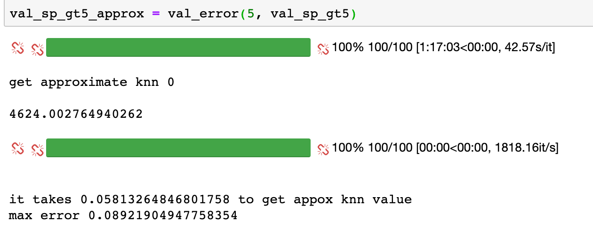

# Data Valuation

This repo is the official code base for PVLDB paper "Efficient task-specific data valuation for nearest neighbor algorithms".

-----

It contains scripts to calculate exact Shapley value (in the `exact_sp.py`) and approximate Shapley value based on LSH (in the `LSH_sp.py`) for KNN classifier.

We also provide two examples about how to calculate exact Shapley value (in the `exact_sp_example.py`) and approximate Shapley value (in the `LSH_sp_example.py`) on Cifar-10 dataset.

In the reproduction folder, we provide our jupyter notebook scripts for tree datasets (Cifar-10, ImageNet, and YFCC100M), which recorded our experiment results, to help reproduce our experiments.

For example:

If you have any questions about our code, please do not hesitate to ask in the issues. Thanks!  

          